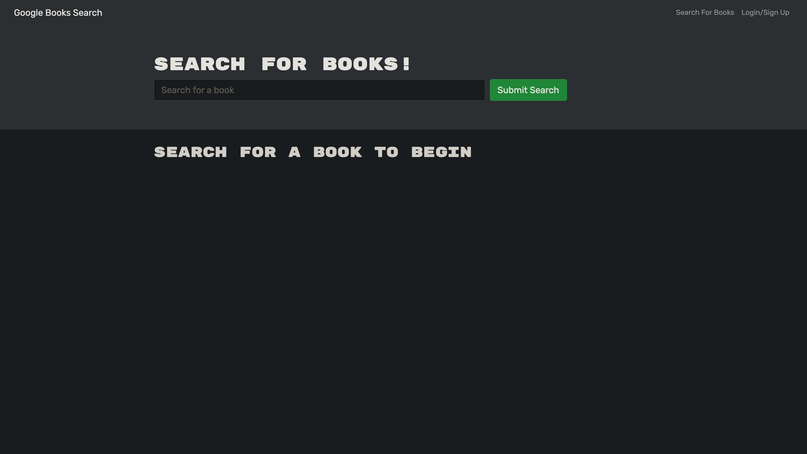
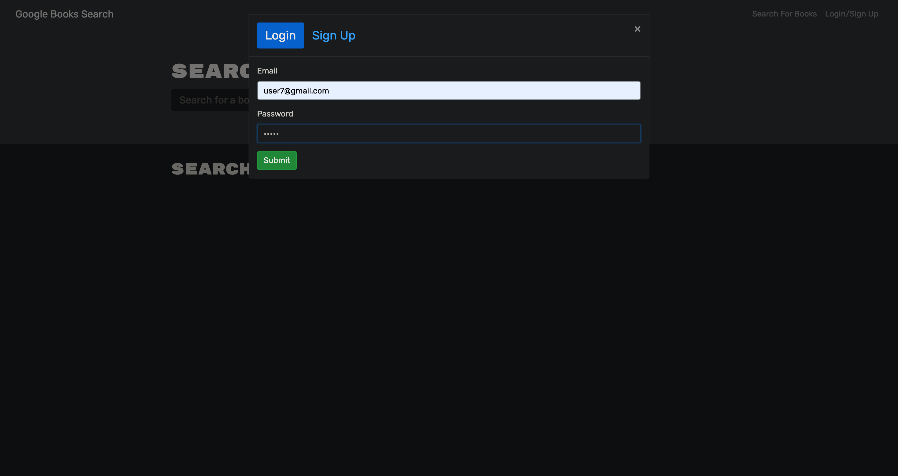
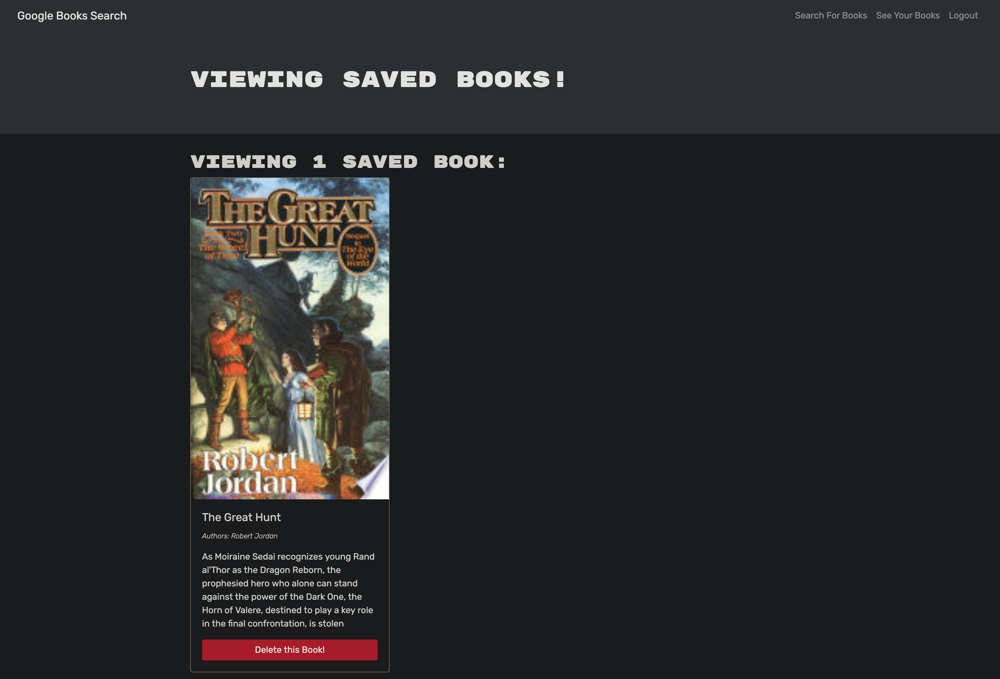

# Book Search Engine

## Description

The Book Search Engine allows users to find quick synopsis to books and save ones that appeal to their interests for later reading.

## Table of Contents
- [Installation](#installation)
- [Usage](#usage)
- [Contributions](#contributions)

## Installation
For a local install, clone the repository and run `npm i` to install dependencies. `npm develop` will start a local server.

## Usage
The homepage will give you an option to search for a book. In order to save a book, you must be logged in as a user.

## Contributions
Made by DJ Rhoten